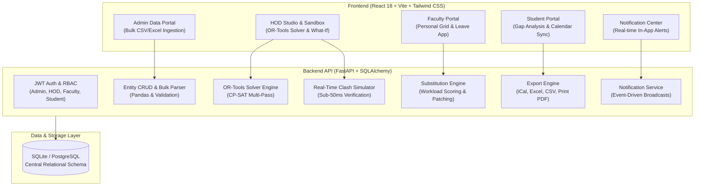

# ClassSquare
### Autonomous Multi-Constraint Academic Scheduler & Operations Platform

[](https://class-square.vercel.app)
[](https://classsquare-api.onrender.com/docs)
[](https://developers.google.com/optimization)
[](https://class-square.vercel.app)

> 🚀 **Live Production Application:** [https://class-square.vercel.app](https://class-square.vercel.app)  
> Autonomous Multi-Constraint Timetable Optimization for Modern Higher Education

---

## 1. Executive Summary & Problem Context

Higher education institutions face massive administrative bottlenecks in scheduling courses:
- **Combinatorial Explosion:** 1,000+ students, 80+ faculty, and 50+ classrooms yield over $10^{18}$ potential schedule permutations (an NP-hard problem).
- **NEP 2020 Multi-Disciplinary Mandate:** Floating cross-department electives require concurrent, synchronized time blocks across disparate student cohorts without causing core course collisions.
- **Faculty Workload & UGC Compliance:** Overbooking educators beyond institutional daily/weekly caps leads to instructor burnout.
- **Infrastructure Bottlenecks:** Specialized laboratory shortages, equipment constraints, and room capacity mismatches.
- **Emergency Absences:** Unplanned faculty sick leaves cause frantic last-minute phone calls and lost classroom hours.

**ClassSquare** is an enterprise-grade academic operating system and timetable optimization engine. Powered by **Google OR-Tools CP-SAT (Constraint Programming - Satisfiability)**, ClassSquare enforces strict mathematical invariants guaranteeing **0 clashes**, provides HODs with a real-time **sub-50ms What-If Collision Sandbox**, gives students a direct democratic voice through **Student Democracy Pulse Voting**, and autonomously dispatches **Intelligent Substitutions** during sudden leaves based on workload equity scoring.

---

## 2. System Architecture



---

### 2. Technology Stack Breakdown

| Layer | Technology | Purpose & Implementation |
|---|---|---|
| **Mathematical AI & Solver** | **Google OR-Tools CP-SAT** | Translates academic rules into Boolean Satisfiability & Integer Programming. Formulates 8 hard constraints with Pareto soft-goal optimization. |
| **Backend Framework** | **FastAPI (Python 3.11)** | High-throughput asynchronous REST API engine with auto-generated OpenAPI / Swagger docs. |
| **Database & ORM** | **SQLAlchemy 2.0 + SQLite / PostgreSQL** | Relational data persistence with strict foreign key integrity and relational cascading handlers. |
| **Data Processing** | **Pandas & OpenPyXL** | Multi-format CSV and Excel parser with row-level pre-commit error validation and schema inspection. |
| **Authentication** | **JWT & Passlib (Bcrypt)** | Stateless JWT tokens with SHA-256 password hashing and multi-role access control (Admin, HOD, Faculty, Student). |
| **Calendar Sync & Export** | **RFC 5545 iCalendar (`.ics`)** | Generates recurring calendar sync events for Google Calendar, Apple Calendar, and Microsoft Outlook. |
| **Frontend Framework** | **React 18 (SPA) + Vite 5** | High-performance Single Page Application with Hot Module Replacement and modular component hierarchy. |
| **UI Components & Icons** | **Material UI (MUI v5) + Lucide** | Accessible enterprise dialogs, tables, snackbars, and clean vector icons. |
| **Styling & Theme** | **Tailwind CSS + Custom Sky Blue UI** | Modern sky blue canvas (`#e0f2fe`) paired with deep slate typography and high-contrast status chips. |

---

## 3. Key Technical Innovations & Platform Features

### 3.1 Google OR-Tools CP-SAT Solver (8 Hard Constraints)
ClassSquare translates university scheduling into an exact mathematical constraint satisfaction problem guaranteeing **0 clashes**:
1. **Room Conflict Free:** No classroom or lab is occupied by more than one cohort during period $(d, p)$.
2. **Faculty Conflict Free:** No instructor is scheduled to teach more than one section during $(d, p)$.
3. **Cohort Conflict Free:** No student batch is assigned to more than one lecture/lab during $(d, p)$.
4. **Room Capacity Feasibility:** Room capacity meets or exceeds batch student strength ($\text{RoomCapacity} \ge \text{CohortStrength}$).
5. **Laboratory Designation:** Lab subjects are strictly placed into certified laboratories (`is_lab=True`).
6. **Weekly Curriculum Quotas:** Exactly $N$ weekly periods allocated per subject.
7. **Shift Compliance:** Morning (Periods 1–6) and Evening (Periods 1–6) schedules adhere to strict shift boundaries.
8. **NEP 2020 Elective Band Synchronization:** Multidisciplinary electives sharing an `ElectiveBand` are bound to identical $(d, p)$ slots across all participating cohorts.

### 3.2 HOD Solver Studio & What-If Clash Detection Sandbox
- Generates **3 distinct, clash-free timetable slates** with different scheduling tradeoffs in seconds.
- **Sub-50ms Collision Simulator:** Click or drag any class slot to test room, teacher, or period reassignments. The sandbox validates double-booking and teacher certifications in real time.

### 3.3 Student Democracy Pulse & Voting
- HODs open democratic voting on generated timetable options during semester planning.
- **Controlled Access:** Students only see the voting tab when a voting window is actively open.
- **Student-Centric Options:** Each option is tailored for specific student needs:
  - *Option 1: Commute-Optimized* (Minimized gaps between classes, ideal for day scholars)
  - *Option 2: Workload-Balanced* (Even distribution of intensive courses throughout the week)
  - *Option 3: Lab-Paced* (Continuous morning laboratory blocks leaving afternoons for projects)
- Live student vote tallies stream directly into the HOD Studio.

### 3.4 Automated Leave & Intelligent Substitution Engine
- Faculty members apply for emergency leaves directly from their personal dashboard.
- Algorithm scores available qualified faculty members using an equitable workload formula:
  $$\text{Score} = 100 - \left(\frac{\text{Current Weekly Load}}{\text{Max Permitted Load}} \times 50\right) + (\text{Same Department} \times 20)$$
- Protects junior teachers from overload and ensures fair distribution.
- One-click HOD approval patches the master grid and triggers student notifications.

### 3.5 Compact Interactive Timetables
- Ultra-clean default view displaying subject name, color code, and course badge.
- Clicking any cell expands it inline to reveal professor name, room/lab venue, and cohort details.
- Toggle between Compact View and Full Detail View with one click.

### 3.6 Institutional Admin Data Hub & Safe Cascading Clear
- Central repository for **Departments, Rooms/Labs, Faculty, Subjects, and Batches**.
- **Bulk CSV / Excel Ingestion:** Upload complete institutional datasets with live pre-commit validation previews.
- **Cascading Clear Data:** Dedicated red-accented danger zone buttons under each category table with modal confirmation and relational cascade cleanup.

### 3.7 Multi-Format Schedule Export
- **RFC 5545 iCalendar (`.ics`):** Direct import into Google Calendar, Apple Calendar, and Outlook.
- **Dual-Sheet Excel (`.xlsx`):** Sheet 1 contains a visual grid; Sheet 2 contains raw tabular slots.
- **Print-Ready PDF:** Native browser print styling formatted for A4 landscape paper.

---

## 4. Quick Start & Demo Setup

### Prerequisites
- **Python 3.10+**
- **Node.js 18+**

### 1-Click Startup (Windows)
Double-click `run.bat` or run:
```cmd
run.bat
```
This script validates your environment, seeds the realistic demo dataset, launches the FastAPI backend on port 8000, launches Vite on port 5173, and opens your browser.

### 1-Click Startup (macOS / Linux)
```bash
chmod +x run.sh
./run.sh
```

### Manual Setup (Alternative)

#### 1. Backend Setup
```bash
cd backend
python -m venv venv
# Windows:
.env\Scriptsctivate
# Linux/macOS:
source venv/bin/activate

pip install -r requirements.txt
python seed_demo.py
uvicorn app.main:app --reload --host 127.0.0.1 --port 8000
```

#### 2. Frontend Setup
```bash
cd frontend
npm install
npm run dev
```

### 🌐 Live Production Deployment
- **Production Web Application:** [https://class-square.vercel.app](https://class-square.vercel.app)
- **Production API & Swagger Docs:** [https://classsquare-api.onrender.com/docs](https://classsquare-api.onrender.com/docs)
- **Local Dev URL:** [http://localhost:5173](http://localhost:5173)
- **Local Swagger Docs:** [http://127.0.0.1:8000/docs](http://127.0.0.1:8000/docs)

---

## 5. Demo Accounts

| Role | Email | Password | Primary Capabilities |
|---|---|---|---|
| **System Admin** | `admin@opticlass.edu` | `admin123` | Institutional data CRUD, bulk CSV ingestion, templates, system KPIs |
| **HOD (CSE)** | `hod.cse@opticlass.edu` | `hod123` | AI solver generation, What-If override sandbox, timetable approval, substitution dispatch |
| **Faculty Member** | `faculty.turing@opticlass.edu` | `faculty123` | Personal weekly schedule, calendar sync (.ics), leave applications |
| **Student** | `student.cse@opticlass.edu` | `student123` | Cohort schedule viewer, gap-time study analysis, calendar sync (.ics), Excel/PDF export |

---

## 6. 5-Minute Evaluator Walkthrough Guide

To experience the complete power of **ClassSquare** in a live evaluation session:

### Step 1: Login as HOD (`hod.cse@opticlass.edu` / `hod123`)
1. Navigate to **[https://class-square.vercel.app/login](https://class-square.vercel.app/login)** (or click any of the 4 demo role cards to auto-fill credentials).
2. You will land on the **HOD Command Center**.
3. Under the **Timetable & What-If Studio** tab:
   - Notice the pre-generated, approved timetable for **Computer Science & Engineering · Semester 3**.
   - Review the **0 Clashes** indicator and Option rankings.
   - Click on any scheduled class slot in the matrix (e.g. *Data Structures at Period 1*) to open the **What-If Sandbox Modal**.
   - Test changing the room or period to see the **real-time clash detection** immediately validate the override.

### Step 2: Test the Intelligent Substitution Engine
1. In the HOD Command Center, switch to the **Leave & Substitution Hub** tab.
2. Observe the pending leave request from **Dr. Alan Turing**.
3. Click **Find Best Substitute**:
   - The AI evaluates teacher certifications and weekly workloads.
   - Notice **Dr. Ada Lovelace** ranked as the **Top Recommendation** with her workload score.
   - Click **Assign Substitute** to finalize the reassignment.
   - Check the **Notification Bell** in the top-right navbar to see the alert generated!

### Step 3: Inspect the Faculty Portal (`faculty.turing@opticlass.edu` / `faculty123`)
1. Click **Faculty Portal** in the top navigation bar.
2. View Dr. Turing's personal teaching schedule matrix and workload KPIs.
3. Click **Sync Calendar (.ics)** to download an iCalendar file ready to import into Google Calendar or Outlook.
4. Click **+ Apply for Leave** to demonstrate how easy it is for an instructor to submit a leave request.

### Step 4: Inspect the Student Portal & Gap-Time Analysis
1. Click **Student Portal** in the navigation bar.
2. Select **Cohort: Batch CS-3A**.
3. Review the **Gap-Time Analysis Cards**:
   - Total weekly classes.
   - Free periods out of 30.
   - **Study Break Gaps** with specific periods identified for library or revision sessions.
4. Test the **Export Toolbar**:
   - Click **📊 Excel (.xlsx)** to download the dual-sheet workbook.
   - Click **📅 Sync Calendar (.ics)** to download the cohort schedule for calendar sync.
   - Click **🖨️ Print / PDF** to see the clean, print-optimized schedule layout.

---

## 7. Demo Seed Data Files

Ready-to-upload demo CSV files are located in [`demo_seed_data/`](demo_seed_data/):
1. `01_departments.csv` — Academic divisions (Computer Science & Engineering, IT, Electronics).
2. `02_rooms.csv` — Smart classrooms and specialized computer/hardware labs.
3. `03_subjects.csv` — Core theory, practical labs, and synchronized NEP Elective Bands (`NEP Open Elective Band A`).
4. `04_faculty.csv` — Faculty members with UGC workload caps and subject qualifications.
5. `05_batches.csv` — Student cohorts matching room capacities.

*Upload sequence:* `Departments ➔ Rooms ➔ Subjects ➔ Faculty ➔ Batches`.

---

## 8. Verification & Automated Test Suite

The platform includes a comprehensive automated test suite with **100% test pass rate**:

```bash
cd backend
.\venv\Scripts\python.exe -m pytest tests/ -v
```

### Test Coverage Results:
- `test_auth.py`: JWT generation, role-based access control, registration security.
- `test_crud_upload.py`: Entity CRUD and bulk CSV validation with row-level error reporting.
- `test_solver.py`: Google OR-Tools solver execution, 8 hard constraints, and plain-language infeasibility diagnostics.
- `test_approval_whatif.py`: HOD approval/rejection trail and real-time clash simulation.
- `test_substitution.py`: Leave application, ranking algorithm, and slot reassignment.
- `test_notifications_export.py`: Notification lifecycle, CSV/Excel/iCal exports, and batch gap-time analytics.

**Result:** `31 passed across all test suites.`

---

## 9. License & Team

**ClassSquare** — Enterprise Higher Education Resource Optimization Platform.  
Built for universities, colleges, and autonomous modern institutions.
All rights reserved.
